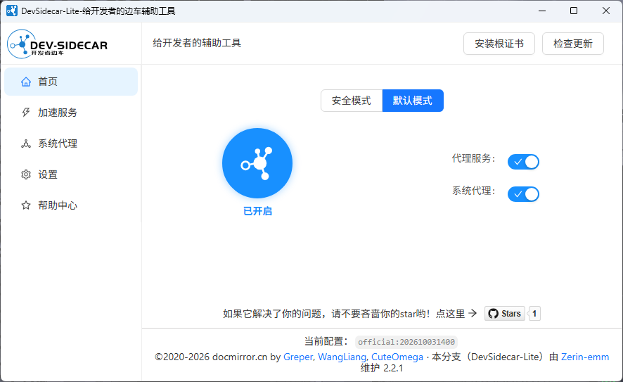

# dev-sidecar-lite

开发者边车，命名取自service-mesh的service-sidecar，意为为开发者打辅助的边车工具（以下简称ds）
通过本地代理的方式将https请求代理到一些国内的加速通道上

<a href='https://github.com/Zerin-emm/dev-sidecar-lite'></a>

[](https://www.star-history.com/#Zerin-emm/dev-sidecar-lite&type=date&legend=top-left)


本仓库基于 [docmirror/dev-sidecar](https://github.com/docmirror/dev-sidecar) 2.2.0 精简而来，改动如下
| 项 | 原版 2.2.0 | 极简版 |
|---|:---:|---|
| 插件系统（free-eye/npm/pip/git/overwall）| ✓ | ✗ |
| 增强模式 + PAC | ✓ | ✗ |
| 远程配置（自动下载/刷新）| ✓ | ✗ |
| 百度统计上报 | ✓ | ✗ |
| 自动下载更新（electron-updater）| ✓ | ✗ 只查版本跳 Releases |
| 内置油猴脚本 ×3 | ✓ | ✗ 只留 GitHub 下载脚本 |
| 测试 / CI / AUR | ✓ | ✗ |
| Mac / Linux 安装包 | ✓ | ✗ 只出 Windows |
| 默认请求超时 | 20s | 10s |
| 假"连接超时"（刷新无效）| ✗ | ✓ 复用连接也清定时器 |
| 粘性坏 IP | ✗ | ✓ 失败剔除 + 10 分钟冷却 |
| ECONNRESET | ✗ 不重试 | ✓ 换 IP 重试 1 次 |
| SNI 伪装下证书校验 | ✗ 形同关闭 | ✓ 按真实域名校验 |
| Windows 装 CA | 弹向导手点 | 静默 certutil |
| 更新检查 | GitHub API（易 403）| releases.atom |
| 更新检查/深色标题栏/排除项卡顿 | ✗ | ✓ 都修了 |
| 品牌 | dev-sidecar | DevSidecar-Lite |

## 重要提醒

> ------------------------------重要提醒1---------------------------------
>
> 注意：本应用启动会自动修改系统代理，所以会与其他代理软件有冲突，一起使用时请谨慎使用。
>
> 与 `Watt Toolkit（原Steam++）` 共用时，请以hosts模式启动Watt Toolkit
>
> 与 `TUN网卡模式运行的游戏加速器` 可以共用
>
> 本应用主要目的在于直连访问github，如果你已经有飞机了，那建议还是不要用这个自行车（ds）了

## 一、 特性

### 1.1、 dns优选（解决\*\*\*污染问题）

- 根据网络状况智能解析最佳域名ip地址，获取最佳网络速度
- 解决一些网站和库无法访问或访问速度慢的问题
- 建议遇到打开比较慢的国外网站，可以优先尝试将该域名添加到dns设置中（注意：被\*\*\*封杀的无效）

### 1.2、 请求拦截

- 拦截打不开的网站，代理到加速镜像站点上去。
- 可配置多个镜像站作为备份
- 具备测速机制，当访问失败或超时之后，自动切换到备用站点，使得目标服务高可用

### 1.3、 github加速

- github 直连加速 (通过修改sni实现，感谢 [fastGithub](https://github.com/dotnetcore/FastGithub) 提供的思路)
- release、source、zip下载加速
- clone 加速
- 头像加速
- 解决readme中图片引用无法加载的问题
- gist.github.com 加速
- 解决git push 偶尔失败需要输入账号密码的问题（fatal: TaskCanceledException encountered / fatal: HttpRequestException encountered）
- raw/blame加速

> 以上部分功能通过 `X.I.U` 的油猴脚本实现， 以下是仓库和脚本下载链接，大家可以去支持一下。
>
> - [https://github.com/XIU2/UserScript](https://github.com/XIU2/UserScript)
> - [https://greasyfork.org/scripts/412245](https://greasyfork.org/scripts/412245)
>
> 由于此脚本在ds中是打包在本地的，更新会不及时，你可以直接通过浏览器安装油猴插件使用此脚本，从而获得最新更新（ds本地的可以通过 `加速服务->基本设置->启用脚本` 进行关闭）。

### 1.4、 Stack Overflow 加速

- 将ajax.google.com代理到加速CDN上
- recaptcha 图片验证码加速

**_安全警告_**：

- 请勿在配置文件中使用来源不明的代理地址，有隐私和账号泄露风险
- 本应用承诺不收集任何信息。介意者请使用安全模式。

## 二、快速开始

支持windows、Mac、Linux(Ubuntu) [仅打包了Windows平台安装包且仅测试了Windows端]

Mac、Linux(Ubuntu)→[docmirror/dev-sidecar](https://github.com/docmirror/dev-sidecar)

### 2.1、DevSidecar桌面应用

#### 1）下载安装包

- release下载
  [Github Release](https://github.com/Zerin-emm/dev-sidecar-lite/releases)

> Windows: 请选择DevSidecar-Lite-x.x.x-x64.exe
>

> 注意：由于没有买应用证书，所以应用在下载安装时会有“未知发行者”等安全提示，选择保留即可。

#### 2）安装后打开

界面应大致如下图所示：

> 注意：mac版安装需要在“系统偏好设置->安全性与隐私->通用”中解锁并允许应用安装



#### 3）安装根证书

第一次打开会提示安装证书，根据提示操作即可

更多有关根证书的说明，请参考 [为什么要安装根证书?](./doc/caroot.md)

> 根证书是本地随机生成的，所以不用担心根证书的安全问题（本应用不收集任何用户信息）
>
> 你也可以在加速服务设置中自定义根证书（PEM格式的证书与私钥）

> 火狐浏览器需要[手动安装证书](#3火狐浏览器火狐浏览器不走系统的根证书需要在选项中添加根证书)

#### 4）开始加速吧

去试试打开github、huggingface、docker hub吧

### 2.2、开启前 vs 开启后

|          | 开启前                         | 开启后                                            |
| -------- | ------------------------------ | ------------------------------------------------- |
| 头像     |          |                             |
| clone    |     |                               |
| zip 下载 |  | 秒下的，实在截不到速度的图 |

## 三、模式说明

### 3.1、安全模式

- 此模式：关闭拦截、开启dns优选、开启测速
- 最安全，无需安装证书，可以在浏览器地址栏左侧查看域名证书
- 功能也最弱，只有特性1，相当于查询github的国外ip，手动改hosts一个意思。
- github的可访问性不稳定，取决于IP测速，如果有绿色ip存在，就 `有可能` 可以直连访问。
  

### 3.2、默认模式

- 此模式：开启拦截、开启dns优选、开启测速
- 需要安装证书，通过修改sni直连访问github
- 功能上包含特性1/2/3/4。

## 四、 最佳实践

- 把dev-sidecar-lite一直开着就行了
- 建议遇到打开比较慢的国外网站，可以尝试将该域名添加到dns设置中（注意：被\*\*\*封杀的无效）

### 其他加速

#### 1）git clone 加速

- 方式1：快捷复制：

  > 开启脚本支持，然后在复制clone链接下方，即可复制到加速链接

- 方式2：

  > 1. 使用方式：用实际的名称替换 `{}` 的内容，即可加速clone [https://hub.fastgit.org/{username}/{reponame}.git](https://hub.fastgit.org/%7Busername%7D/%7Breponame%7D.git)
  > 2. clone 出来的 remote "origin" 为fastgit的地址，需要手动改回来
  > 3. 你也可以直接使用他们的clone加速工具 [fgit-go](https://github.com/FastGitORG/fgit-go)

## 五、api

### 5.1、拦截配置

没有配置域名的不会拦截，其他根据配置进行拦截处理。

在【加速服务-拦截设置】中配置，格式如下：（更多内容参见[wiki](https://github.com/docmirror/dev-sidecar/wiki/%E5%8A%A0%E9%80%9F%E6%9C%8D%E5%8A%A1%E4%BD%BF%E7%94%A8%E8%AF%B4%E6%98%8E)）

```json
{
  // 要拦截的域名
  "github.com": {
    // 需要拦截url的正则表达式
    "/.*/.*/releases/download/": {
      // 拦截类型
      // "redirect": "url",        // 临时重定向（url会变，一些下载资源可以通过此方式配置）
      // "proxy": "url",           // 代理（url不会变，没有跨域问题）
      // "abort": true,            // 取消请求（适用于被***封锁的资源，找不到替代，直接取消请求，快速失败，节省时间）
      // "success": true,          // 直接返回成功请求（某些请求不想发出去，可以伪装成功返回）
      // "cacheDays": 1,           // GET请求的使用缓存，单位：天（常用于一些静态资源）
      // "options": true,          // OPTIONS请求直接返回成功请求（该功能存在一定风险，请谨慎使用）
      // "optionsMaxAge": 2592000, // OPTIONS请求缓存时间，默认：2592000（一个月）

      // 拦截配置示例：
      "redirect": "download.fastgit.org"
    },
    ".*": {
      "proxy": "github.com",
      "sni": "baidu.com" // 修改sni，规避***握手拦截
    }
  },
  "ajax.googleapis.com": {
    ".*": {
      "proxy": "ajax.loli.net", // 代理请求，url不会变
      "backup": ["ajax.proxy.ustclug.org"], // 备份，当前代理请求失败后，将会切换到备用地址
      "test": "ajax.googleapis.com/ajax/libs/jquery/1.12.4/jquery.min.js",
      "replace": "/(.*)/xxx" // 当加速地址的链接和原链接不是完全相同时，可以通过正则表达式replace，此时proxy通过$1$2来重组url， proxy:'ajax.loli.net/xxx/$1'
    }
  },
  "clients*.google.com": {
    ".*": {
      "abort": true // 取消请求，被***封锁的资源，找不到替代，直接取消请求，快速失败，节省时间
    }
  }
}
```

### 5.2、DNS优选配置

某些域名解析出来的ip会无法访问，（比如api.github.com会被解析到新加坡的ip上，新加坡的服务器在上午挺好，到了晚上就卡死，基本不可用）

通过从dns上获取ip列表，切换不同的ip进行尝试，最终会挑选到一个最快的ip（该功能需要事先配置好所用DNS），更多说明参见[wiki](https://github.com/docmirror/dev-sidecar/wiki/%E5%8A%A0%E9%80%9F%E6%9C%8D%E5%8A%A1%E4%BD%BF%E7%94%A8%E8%AF%B4%E6%98%8E)

```json
{
  "dns": {
    "mapping": {
      "api.github.com": "cloudflare", // "解决push的时候需要输入密码的问题",
      "gist.github.com": "cloudflare", // 解决gist无法访问的问题
      "*.githubusercontent.com": "cloudflare" // 解决github头像经常下载不到的问题
    }
  }
}
```

注意：暂时只支持IPv4的解析

## 六、问题排查

### 6.1、dev-sidecar的前两个开关没有处于打开状态

1. 尝试将开关按钮手动打开
2. 请尝试右键dev-sidecar图标，点退出。再重新打开
3. 如果还不行，请将日志发送给作者

如果是mac系统，可能是下面的原因

#### 1）Mac系统使用时，首页的系统代理开关无法打开

出现这个问题可能是没有开启系统代理命令的执行权限

```
networksetup -setwebproxy 'WiFi' 127.0.0.1 31181
#看是否有如下错误提示
** Error: Command requires admin privileges.
```

如果有上面的错误提示，请尝试如下方法：

> 取消访问偏好设置需要管理员密码
>
> 系统偏好设置—>安全性与隐私—> 通用—> 高级—> 访问系统范围的偏好设置需要输入管理员密码（取消勾选）

### 6.2、没有加速效果

1. 本应用默认仅开启https加速，一般足够覆盖需求。
   如果你访问的是仅支持http协议的网站，请手动在【系统代理】中打开【代理HTTP请求】
2. 检查浏览器是否装了什么插件，与ds有冲突
3. 检查是否安装了其他代理软件，与ds有冲突
4. 请确认浏览器的代理设置为使用IE代理/或者使用系统代理状态
5. 可以尝试换个浏览器试试
6. 请确认网络代理设置处于勾选状态
   正常情况下ds在“系统代理”开关打开时，会自动设置系统代理。

### 6.3、浏览器打开提示证书不受信任


一般是证书安装位置不对，重新安装根证书后，重启浏览器

#### 1）windows: 请确认证书已正确安装在“本地计算机-将所有的证书都放入下列存储：受信任的根证书颁发机构”下

#### 2）mac: 请确认证书已经被安装并已经设置信任

#### 3）火狐浏览器：火狐浏览器不走系统的根证书，需要在选项中添加根证书

1. 火狐浏览器->选项->隐私与安全->证书->查看证书
   
2. 证书颁发机构->导入
3. 选择证书文件 `C:\Users(用户)\Administrator(你的账号)\.dev-sidecar\dev-sidecar.ca.crt`（Mac或linux为 `~/.dev-sidecar` 目录）
   
4. 勾选信任由此证书颁发机构来标识网站，确定即可
   

### 6.4、打开github显示连接超时

```html
DevSidecar Warning: Error: www.github.com:443, 代理请求超时
```

1. 检查测速界面github.com是否有ip ，如果没有ip，则可能是由于你的网络提供商封锁了dns服务商的ip（试试能否ping通：1.1.1.1 / 9.9.9.9 ）
2. 如果是安全模式，则是因为不稳定导致的，等一会再刷新试试

### 6.5、查看日志是否有报错

如果还是不行，请在下方加官方QQ群或提issue，附上服务日志（server.log）以便进行分析

日志打开方式：加速服务->右边日志按钮->打开日志文件夹


### 6.6、某些原本可以打开的网站打不开了

1. 可以尝试关闭pac
2. 可以将域名加入白名单

### 6.7、应用意外关闭导致没有网络了

应用开启后会自动修改系统代理设置，正常退出会自动关闭系统代理
当应用意外关闭时，可能会因为没有将系统代理恢复，从而导致完全无法上网。

对于此问题有如下几种解决方案可供选择：

1. 重新打开应用即可（右键应用托盘图标可完全退出，将会正常关闭系统代理设置）
2. 如果应用被卸载了，此时需要[手动关闭系统代理设置](./doc/recover.md)
3. 如果你是因为开着ds的情况下重启电脑导致无法上网，你可以设置ds为开机自启

### 6.8、卸载应用后上不了网，git请求不了

如果你在卸载应用前，没有正常退出app，就有可能无法上网。请按如下步骤操作恢复您的网络：

1、关闭系统代理设置，参见：[手动关闭系统代理设置](./doc/recover.md)
2、执行下面的命令关闭git的代理设置（如果你开启过 `Git.exe代理` 的开关）

```shell
git config --global --unset http.proxy
git config --global --unset https.proxy
git config --global --unset http.sslVerify
```

3、执行下面的命令关闭npm的代理设置（如果你开启过npm加速的开关）

```shell
npm config delete proxy
npm config delete https-proxy
```

### 6.9、其他问题

请查阅[wiki](https://github.com/docmirror/dev-sidecar/wiki)

也可以查阅[有文档tag的issue](https://github.com/docmirror/dev-sidecar/issues?q=is%3Aissue%20label%3ADocumentation)，它们被开发者认证为相当于文档级别的参考issue。

## 七、从源码运行

### 7.1、准备环境

#### 1）安装 `nodejs` 及其他环境

推荐安装 nodejs `22.x.x` 的版本，其他版本未做测试

Windows上需要msvc，推荐使用VS 2022（node-gyp对VS 2026支持可能存在问题），安装时选择C++桌面开发工作负载即可。

另外还需要带distutils的python，推荐安装自带setuptools的python 3.11版本。如果本地有uv，则可以简单的运行以下命令

```shell
uv init .
uv sync
.venv/Scripts/activate.ps1 # for windows pwsh
.venv/Scripts/activate.bat # for windows cmd
source .venv/bin/activate # for linux/mac
```

这会根据.python-version文件自动安装python 3.11版本。如不想使用python 3.11，也可删除.python-version文件，pyproject.toml已经指定了所需依赖。

#### 2）安装 `pnpm`

运行如下命令即可安装：

```shell
npm install -g pnpm --registry=https://registry.npmmirror.com
```

### 7.2、开发调试模式启动

运行如下命令即可开发模式启动

```shell
# 拉取代码
git clone https://github.com/Zerin-emm/dev-sidecar-lite

cd dev-sidecar

# 注意不要使用 `npm install` 来安装依赖，因为 `pnpm` 会自动安装依赖
pnpm install

# 运行DevSidecar
cd packages/gui
npm run electron

```

> 如果electron依赖包下载不动，可以开启ds的npm加速
> 如果pnpm install只是单纯卡住，大概是因为你忘记进python环境了


## 八、求star

我的其他项目求star

- [Zerin-emm/GithubDesktop-zhTool](https://github.com/Zerin-emm/GithubDesktop-zhTool)
GitHub Desktop 汉化工具，自动检测版本并下载对应汉化文件完成汉化，支持一键还原及软件更新管理.

- [Zerin-emm/VMware-zhTool](https://github.com/Zerin-emm/VMware-zhTool)
自动读取注册表定位安装目录，一键汉化/还原 VMware Workstation Pro 界面，操作前自动检测进程避免冲突.

- [Zerin-emm/RePKG-GUI](https://github.com/Zerin-emm/RePKG-GUI)
RePKG 的图形界面工具, 支持提取 PKG 文件中的媒体资源和所有文件.

- [Zerin-emm/Win11-SetTool](https://github.com/Zerin-emm/Win11-SetTool)
Windows 11 系统优化设置工具, 整合资源管理器/任务栏/隐私等常用设置项, 一键切换即时生效.

## 九、感谢

本项目曾使用lerna包管理工具

[](https://lerna.js.org/)

本项目参考如下开源项目

- [node-mitmproxy](https://github.com/wuchangming/node-mitmproxy)
- [ReplaceGoogleCDN](https://github.com/justjavac/ReplaceGoogleCDN)

特别感谢

- [github增强油猴脚本](https://greasyfork.org/zh-CN/scripts/412245-github-%E5%A2%9E%E5%BC%BA-%E9%AB%98%E9%80%9F%E4%B8%8B%E8%BD%BD) 本项目部分加速功能完全复制该脚本。
- [中国域名白名单](https://github.com/pluwen/china-domain-allowlist)，本项目的系统代理排除域名功能中，使用了该白名单。

本项目部分加速资源由如下组织提供

- [FastGit UK](https://fastgit.org/)


